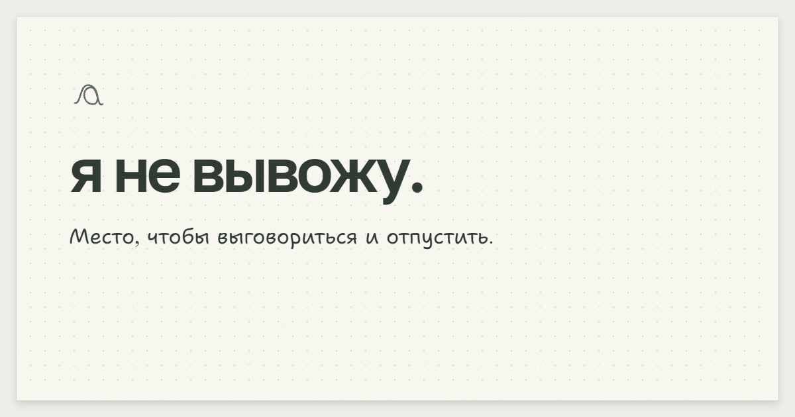

# я не вывожу.

Место, чтобы выговориться письменно. Напиши то, что тревожит, и нажми **«Развеять»** — текст удалится, а лист рассыплется в пепел.

**[Открыть яневывожу.рф](https://яневывожу.рф/)**



Записи остаются только в памяти вкладки и не отправляются на сервер. При обновлении или закрытии страницы они исчезают. Восстановить их нельзя.

Есть светлая, тёмная и системная темы. Сайт запоминает выбранную тему и первое открытие «О сайте». Общий счётчик учитывает только развеяния — без текста записей и идентификаторов посетителей. Сторонней аналитики нет.

## Запуск

Node.js 22.12+ и npm.

```sh
npm ci
npm run dev
```

```sh
npm run check   # проверка типов и Svelte
npm test       # тесты
npm run build  # сборка в dist/
```

Интерфейс: Svelte 5, TypeScript, Vite. Анимация: WebGL. Необязательный [счётчик развеяний](server/README.md): Python и SQLite. Настройки окружения — [.env.example](.env.example).

## Автор

© 2026 Мерзляков Андрей. Все права защищены. Условия использования — [LICENSE](LICENSE).

Сторонние компоненты сохраняют свои лицензии. [Лицензии шрифтов](public/licenses/).
